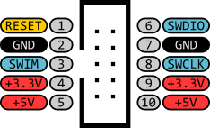

# 🔌 Connecting the Debugger/ Programmer to the STM32F411 Black-Pill

## ST-LINK V2 Pinout

The indicated pinout on the ST-LINK V2 case is not the same as that of the PCB. Follow the pinout as shown below.

<figure><figcaption>
Image as from "<a href="https://stm32-base.org/assets/img/pinouts/ST-LINK_V2_Clone_Header.png">https://stm32-base.org/assets/img/pinouts/ST-LINK_V2_Clone_Header.png</a>"
</figcaption></figure>

## STM32F411 Black-Pill Header for ST-LINK V2 Connection

<figure><figcaption></figcaption></figure>

## STM32F411 connected to ST-LINK V2

<figure><figcaption></figcaption></figure>

> In section [upload-the-first-program-led\_blink.md](upload-the-first-program-led\_blink.md "mention")the first program will be uploaded to STM32F411 through the use of the above connection diagram.
