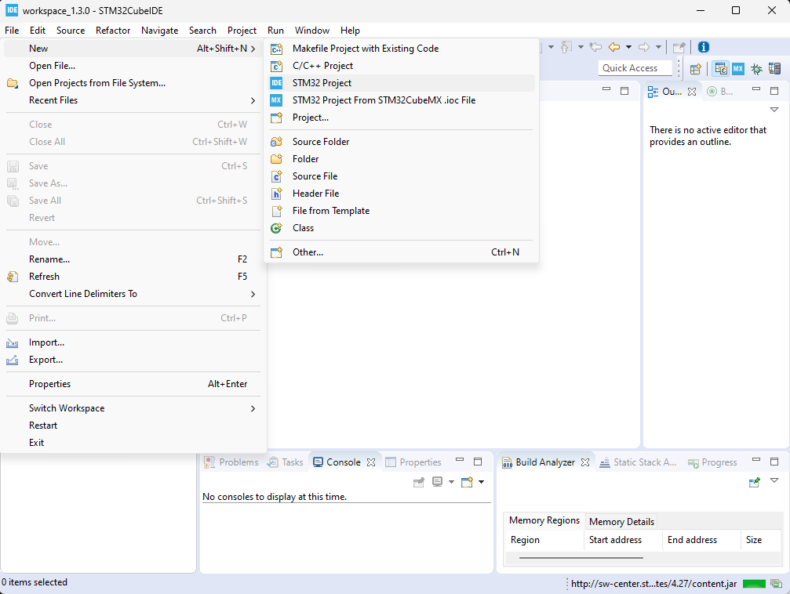
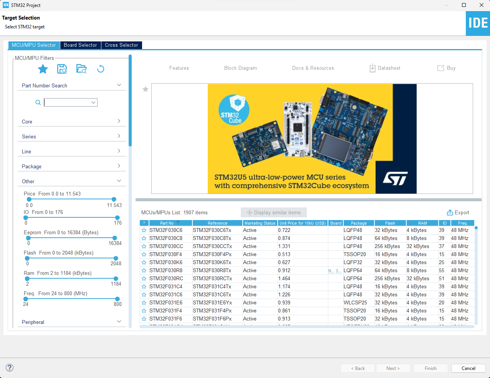
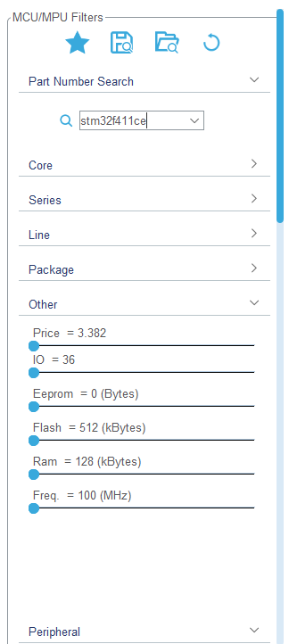
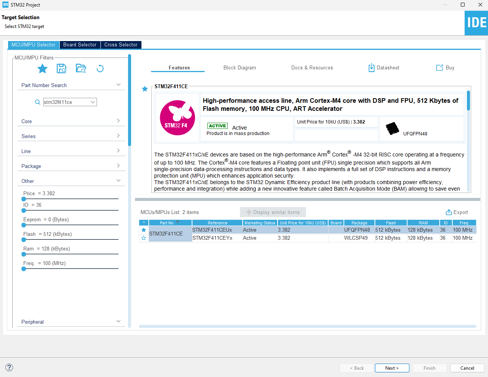
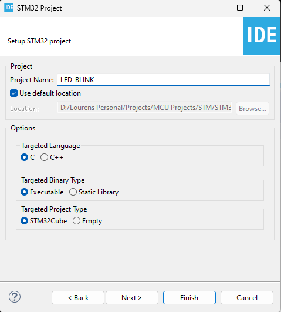

# 💻 Creating the first Project: LED\_BLINK

## Steps to follow to create the first program

1. Open the STM32CubeIDE.exe program
2.  Go to File->New->STM32 Project

    <figure><figcaption></figcaption></figure>
3.  Next, the following window will appear where the MCU model needs to be selected.

    <figure><figcaption></figcaption></figure>
4.  Type the MCU model in the "**Part Number Search**" as indicated below.

    <figure><figcaption></figcaption></figure>
5.  Select the model corresponding to the type present on the STM32 development board and select. The selected model will be highlighted in blue as shown below. Then press on "**Next**" to finalise this step.&#x20;

    <figure><figcaption></figcaption></figure>
6.  Next, enter the name of the project next to "**Project Name:**". Then click on "**Finish**"

    <figure><figcaption></figcaption></figure>
7. The new project is now created and ready to be used. Follow the steps provided in the [setting-up-the-stm32f411-black-pill.md](setting-up-the-stm32f411-black-pill.md "mention") section to complete the basic ".ioc" setup.&#x20;
