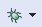

# ▶ Upload the first Program: LED\_BLINK

1.  First, debug the program by selecting the following icon -> . The window shown below will open after the debug option was selected. No changes will be made to the settings. Select "**Apply**" and "**Ok**".

    <figure><figcaption></figcaption></figure>
2.  The following window shown below will open after "OK" was selected. The LED on the ST-LINK V2 will flash rapidly when entering the debug window.

    <figure><figcaption></figcaption></figure>
3. In this window, there are some new icons:
   * Terminate and Relaunch --> 
   * Resume --> 
   * Suspend --> 
   * Terminate --> 



 --> The "**Terminate and Relaunch**" button will close the debugging window and return to the coding window for a brief moment after which it will open the debugging window again.



 --> The "**Resume**" window will start the program on the STM32F411.



 --> The "**Suspend**" button will stop the program on the STM32F411 in its current state.



 --> The "**Terminate**" button will resume the program on the STM32F411, close the debugging window and return to the coding environment.


